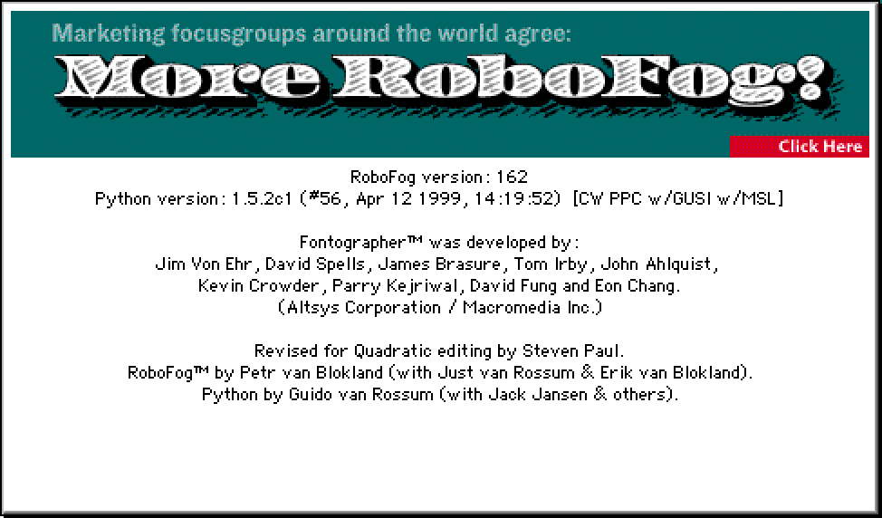

# robofogExport



This is a collection of scripts that will assist extracting font data from old RoboFog files. These script have to run in RoboFog, so you still need [some sort of emulator](http://sheepshaver.cebix.net) or [old computer](https://en.wikipedia.org/wiki/Mac_OS_9).

## Brief reminder of OS9 and Python 1.5

* RoboFog and Python 1.5 did not have any Unicode or UTF-8 support.
* RobofogExport will generates files in Mac encoding.
* RoboFog had no plistlib
* RoboFog had no kerning groups
* Background glyphs are exported with a `#` prefix. 
* Export only
* Filenames have a maximum length of around 31 characters.

## Exporting

* Make sure the whole folder is available to Robofog.
* Open a font
* Run the ExportFontToUFO.py script
* Open the UFO in RoboFont. Other UFO-reading apps might also work, but are untested.
* Optionally: run the `finishRoboFogExport.py` script to move background glyphs in the right place.

Ouput might look like this:
```python
Exporting TestRoboFogFile to UFO:
FogUFOExportLib version1.1
making glyph rename table...
{'oacute': 'oacute', 'four': 'four', 'Acircumflex': 'Acircumflex', 'y': 'y', 'fi': 'fi', 'fl': 'fl', 'u': 'u', 'q': 'q', 'm': 'm', 'thorn': 'thorn', 'i': 'i', 'onesuperior': 'onesuperior', 'e': 'e', 'Ograve': 'Ograve', 'a': 'a', 'grave': 'grave', 'oslash': 'oslash', 'dieresis': 'dieresis', 'Eth': 'Eth', 'eacute': 'eacute', 'multiply': 'multiply', 'U': 'U', 'infinity': 'infinity', 'ucircumflex': 'ucircumflex', 'Q': 'Q', 'aacute': 'aacute', 'M': 'M', 'numbersign': 'numbersign', 'onehalf': 'onehalf', 'approxequal': 'approxequal', 'E': 'E', 'quotedbl': 'quotedbl', 'A': 'A', 'bracketright': 'bracketright', 'Omega': 'Omega', 'quotedblbase': 'quotedblbase', 'yacute': 'yacute', 'hyphen': 'hyphen', 'oe': 'oe', 'percent': 'percent', 'six': 'six', 'question': 'question', 'periodcentered': 'periodcentered', 'florin': 'florin', 'LF': 'LF', 'guillemotleft': 'guillemotleft', 'Lslash': 'Lslash', 'at': 'at', 'Ucircumflex': 'Ucircumflex', 'ugrave': 'ugrave', 'currency': 'currency', 'quoteleft': 'quoteleft', 'backslash': 'backslash', 'brokenbar': 'brokenbar', 'semicolon': 'semicolon', 'ae': 'ae', 'seven': 'seven', 'braceright': 'braceright', 'questiondown': 'questiondown', 'minus': 'minus', 'idieresis': 'idieresis', 'z': 'z', 'v': 'v', 'emdash': 'emdash', 'nine': 'nine', 'r': 'r', 'udieresis': 'udieresis', 'n': 'n', 'circumflex': 'circumflex', 'j': 'j', 'cedilla': 'cedilla', 'ordmasculine': 'ordmasculine', 'f': 'f', 'CR': 'CR', 'b': 'b', 'greaterequal': 'greaterequal', 'igrave': 'igrave', 'breve': 'breve', 'Z': 'Z', 'asciicircum': 'asciicircum', 'I': 'I', 'bracketleft': 'bracketleft', 'R': 'R', 'threequarters': 'threequarters', 'N': 'N', 'daggerdbl': 'daggerdbl', 'Ydieresis': 'Ydieresis', 'J': 'J', 'registered': 'registered', 'sterling': 'sterling', 'F': 'F', 'iacute': 'iacute', 'B': 'B', 'tilde': 'tilde', 'yen': 'yen', 'scaron': 'scaron', 'pi': 'pi', 'lslash': 'lslash', 'greater': 'greater', 'Delta': 'Delta', 'fraction': 'fraction', 'NUL': 'NUL', 'cent': 'cent', 'three': 'three', 'trademark': 'trademark', 'Ccedilla': 'Ccedilla', 'partialdiff': 'partialdiff', 'eight': 'eight', 'Ecircumflex': 'Ecircumflex', 'parenleft': 'parenleft', 'hungarumlaut': 'hungarumlaut', 'ring': 'ring', 'summation': 'summation', 'Thorn': 'Thorn', 'colon': 'colon', 'asciitilde': 'asciitilde', 'ampersand': 'ampersand', 'nbspace': 'nbspace', 'one': 'one', 'ntilde': 'ntilde', 'period': 'period', 'integral': 'integral', 'ocircumflex': 'ocircumflex', 'radical': 'radical', 'divide': 'divide', 'dagger': 'dagger', 'Egrave': 'Egrave', 'Y': 'Y', 'threesuperior': 'threesuperior', 'eth': 'eth', 'Aring': 'Aring', 'w': 'w', 'plus': 'plus', 's': 's', 'Edieresis': 'Edieresis', 'guilsinglright': 'guilsinglright', 'US': 'US', 'equal': 'equal', 'guilsinglleft': 'guilsinglleft', 'k': 'k', 'degree': 'degree', 'ogonek': 'ogonek', 'g': 'g', 'quoteright': 'quoteright', 'c': 'c', 'apple': 'apple', 'exclam': 'exclam', 'acircumflex': 'acircumflex', 'W': 'W', 'caron': 'caron', 'S': 'S', 'O': 'O', 'bullet': 'bullet', 'Igrave': 'Igrave', 'K': 'K', 'product': 'product', 'G': 'G', 'zcaron': 'zcaron', 'mu': 'mu', 'C': 'C', 'Oslash': 'Oslash', 'dotaccent': 'dotaccent', 'o': 'o', 'ellipsis': 'ellipsis', 'lessequal': 'lessequal', 'atilde': 'atilde', 'slash': 'slash', 'twosuperior': 'twosuperior', 'onequarter': 'onequarter', 'endash': 'endash', 'macron': 'macron', 'section': 'section', 'odieresis': 'odieresis', 'space': 'space', 'Odieresis': 'Odieresis', 'germandbls': 'germandbls', 'Adieresis': 'Adieresis', 'egrave': 'egrave', 'braceleft': 'braceleft', 'Scaron': 'Scaron', 'quotesingle': 'quotesingle', 'asterisk': 'asterisk', 'agrave': 'agrave', 'DEL': 'DEL', 'zero': 'zero', 'HT': 'HT', 'Otilde': 'Otilde', 'H': 'H', 'adieresis': 'adieresis', 'Ugrave': 'Ugrave', 'Idieresis': 'Idieresis', 'ordfeminine': 'ordfeminine', 'parenright': 'parenright', 'exclamdown': 'exclamdown', 'x': 'x', 't': 't', 'p': 'p', 'logicalnot': 'logicalnot', 'l': 'l', 'V': 'V', 'Oacute': 'Oacute', 'OE': 'OE', 'h': 'h', 'd': 'd', 'bar': 'bar', 'acute': 'acute', 'Udieresis': 'Udieresis', 'DC1': 'DC1', 'DC3': 'DC3', 'DC2': 'DC2', 'DC4': 'DC4', 'X': 'X', 'underscore': 'underscore', 'T': 'T', 'five': 'five', 'Ocircumflex': 'Ocircumflex', 'Zcaron': 'Zcaron', 'P': 'P', 'L': 'L', 'ydieresis': 'ydieresis', 'uacute': 'uacute', 'D': 'D', 'ecircumflex': 'ecircumflex', 'guillemotright': 'guillemotright', 'Iacute': 'Iacute', 'Eacute': 'Eacute', 'quotesinglbase': 'quotesinglbase', 'notequal': 'notequal', 'otilde': 'otilde', 'DLE': 'DLE', 'RS': 'RS', 'copyright': 'copyright', 'two': 'two', 'quotedblright': 'quotedblright', 'AE': 'AE', 'Aacute': 'Aacute', 'ccedilla': 'ccedilla', 'quotedblleft': 'quotedblleft', 'perthousand': 'perthousand', 'Atilde': 'Atilde', 'paragraph': 'paragraph', 'Yacute': 'Yacute', 'comma': 'comma', 'dotlessi': 'dotlessi', 'Ntilde': 'Ntilde', 'lozenge': 'lozenge', 'edieresis': 'edieresis', 'Agrave': 'Agrave', 'dollar': 'dollar', 'icircumflex': 'icircumflex', 'ograve': 'ograve', 'less': 'less', 'Icircumflex': 'Icircumflex', 'aring': 'aring', 'plusminus': 'plusminus', 'Uacute': 'Uacute'}
	writing .glifs...
writing kerning.plist...
writing fontinfo.plist...
writing metainfo.plist...
writing lib.plist...
Saved at Unix:Users:erik:SharedWithOS9:TestRoboFogFile_RF.ufo
Done!
```

## Credits

RoboFog was a program developed by Petr van Blokland, Just van Rossum, Erik van Blokland, on top of Fontographer 3.5 source material.
